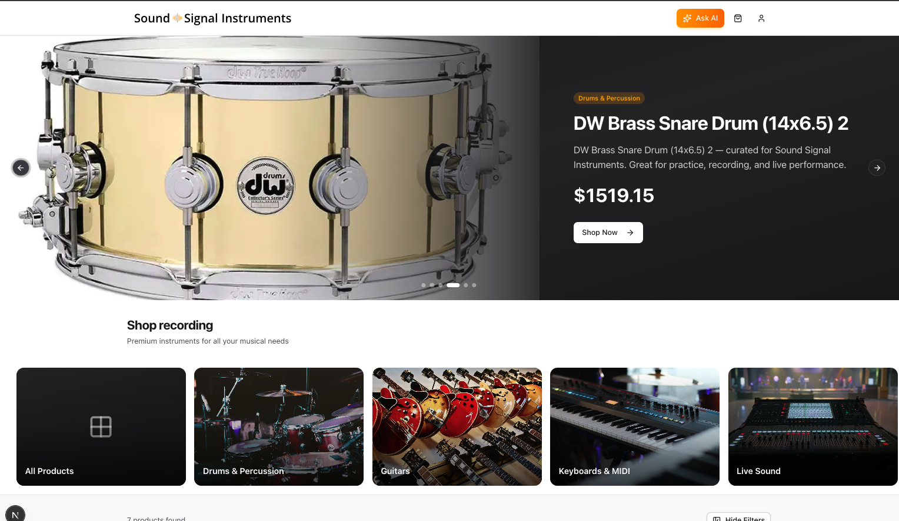
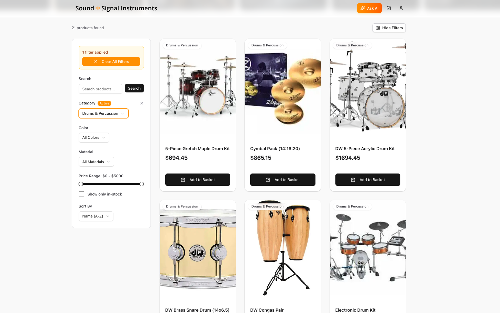
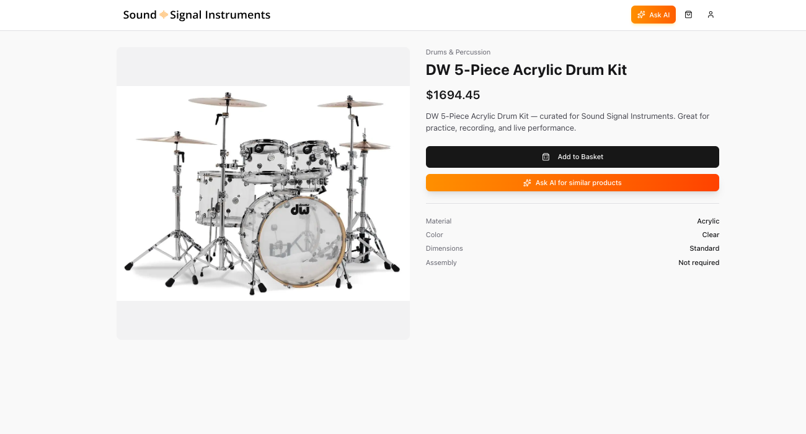
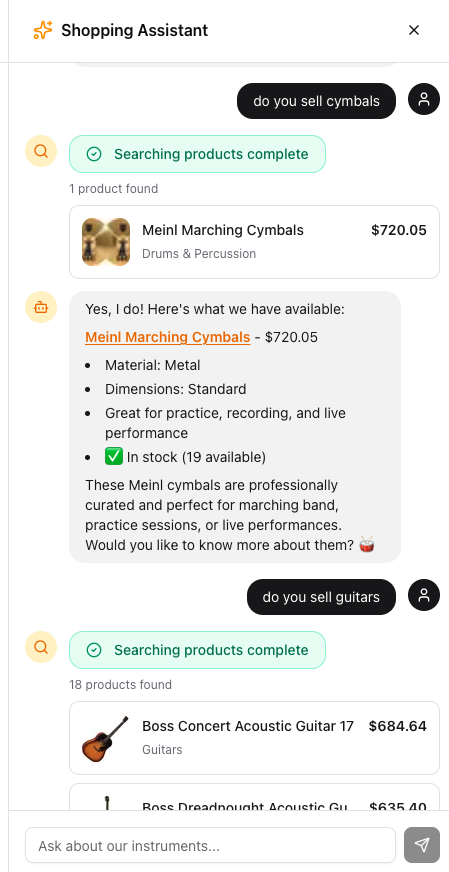
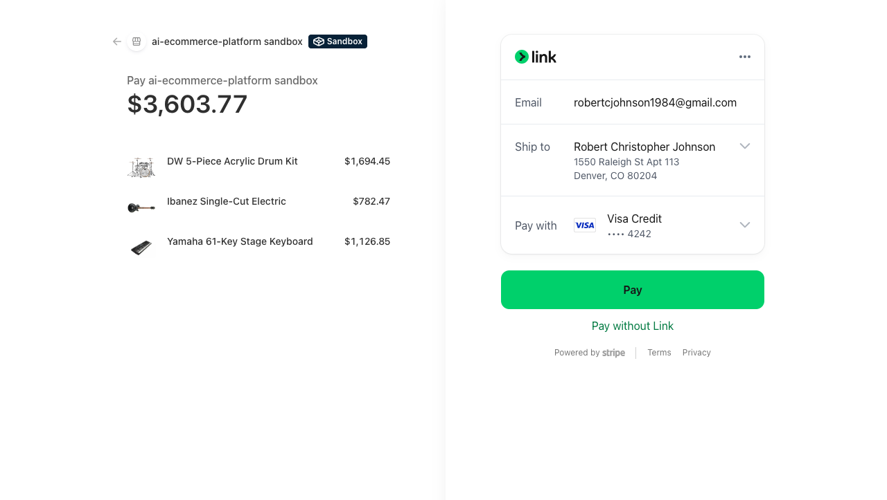
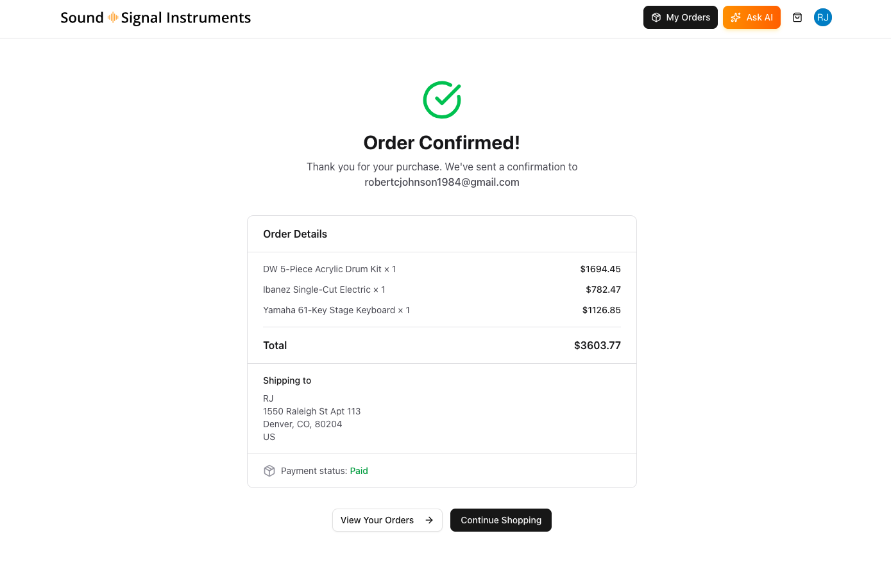

# 🎸 Sound Signal Instruments - AI-Powered E-commerce Platform

[](https://nextjs.org/)
[](https://react.dev/)
[](https://www.typescriptlang.org/)
[](https://www.sanity.io/)
[](https://clerk.com/)
[](https://stripe.com/)
[](https://vercel.com/ai)
[](https://www.anthropic.com/)
[](https://tailwindcss.com/)
[](https://ui.shadcn.com/)
[](https://creativecommons.org/licenses/by-nc/4.0/)

### Next.js • Sanity • Clerk • Stripe • Vercel AI SDK • Claude / GPT

Sound Signal Instruments is an AI-powered, real-time **instrument e-commerce platform** showcasing modern full-stack patterns with authenticated AI agents, live inventory updates, and secure payments. Built as a production-ready reference for developers exploring AI-native commerce experiences.

---

## ✨ Overview

This project is a **modern instrument e-commerce store with a brain** 🧠 — combining real-time CMS updates, AI shopping assistance, and a powerful admin dashboard.

Shoppers can browse instruments, chat with AI, and securely check out.  
Admins get AI-powered insights, inventory alerts, and live content editing — all without page refreshes.

---

## 🖼️ Screenshots

### 🏠 Home & Product Discovery

| Home Page | Product Listing |
|---------|----------------|
|  |  |

### 🎵 Product & AI Assistance

| Product Detail | AI Shopping Assistant |
|---------------|----------------------|
|  |  |

### 🛒 Cart & Checkout Flow

| Cart | Checkout |
|----|----------|
|  |  |

### ✅ Order Completion

| Order Confirmation | |
|-------------------|--|
|  | |

---

## 🚀 Tech Stack

- **Next.js + React** — App Router, Server/Client Components, Server Actions  
- **Sanity CMS** — App SDK, GROQ, TypeGen, real-time mutations  
- **Clerk** — Authentication + AgentKit for AI user context  
- **Vercel AI SDK** — AI Gateway (Claude, GPT, Cohere)  
- **Stripe** — Payments, Checkout, Webhooks  
- **shadcn/ui + Tailwind CSS v4** — Accessible, modern UI  
- **Zustand** — Persisted cart state  
- **TypeScript** — End-to-end type safety  

---

## ⚡ Key Differentiators

- 🤖 AI Shopping Assistant with authenticated tools  
- 🔐 User-aware AI via Clerk AgentKit  
- ⚡ Real-time inventory & content (Sanity Live — no polling)  
- 🧠 AI Admin Dashboard powered by Claude  
- 💳 Stripe Checkout + Webhooks for order processing  
- 🛒 Persisted cart with stock validation  
- 🧩 Embedded Sanity Studio at `/studio`  

---

## 🧠 What Is This App?

Think of it as **an instrument store with an AI sales associate**.

### Customers can:
- 🛒 Browse & buy instruments with live stock updates  
- 🤖 Ask AI to find products, compare prices, or track orders  
- 📦 View order history when signed in  

### Store owners get:
- 📊 AI-generated sales insights & recommendations  
- ✏️ Real-time product & order editing  
- ⚠️ Low-stock alerts & fulfillment tracking  

---

## ✨ Features

### 🧍 For Shoppers

| Feature | Description |
|------|-------------|
| 🤖 AI Shopping Assistant | Natural-language product search & recommendations |
| 🛒 Smart Cart | Persisted cart with live inventory checks |
| 💳 Secure Checkout | Stripe-powered payments |
| 📦 Order Tracking | View orders when signed in |
| 🔄 Live Stock | Real-time inventory visibility |

---

### 🛠️ For Admins

| Feature | Description |
|------|-------------|
| 🧠 AI Insights | Claude-powered trends & action items |
| 📝 Product Management | Live editing via Sanity App SDK |
| 📋 Order Management | Paid → Shipped → Delivered |
| ⚠️ Inventory Alerts | Automatic low-stock warnings |
| 📊 Analytics | Revenue & order metrics |

---

## 🔧 Technical Highlights

| Feature | Technology | Why It Matters |
|------|-----------|---------------|
| ⚡ Real-time UI | Sanity Live + App SDK | Instant updates without refresh |
| 🔐 Authenticated AI | Clerk AgentKit | AI only sees signed-in user data |
| 🧠 AI Gateway | Vercel AI Gateway | Swap models easily |
| 🛒 Cart Persistence | Zustand + localStorage | Cart survives reloads |
| 🧩 Type Safety | TypeScript + TypeGen | CMS → frontend safety |

---

## 🚀 Step-by-Step Setup

### 1. Clone the Repository

```bash
git clone https://github.com/johnsonr84/ai-ecommerce-platform.git
cd ai-ecommerce-sanity-clerk
```

### 2. Install Dependencies

```bash
pnpm install
```

### 3. Set Up Environment Variables

```bash
cp .env.example .env.local
```

```env
# Sanity
NEXT_PUBLIC_SANITY_PROJECT_ID=Your_value_goes_here
NEXT_PUBLIC_SANITY_DATASET=Your_value_goes_here
NEXT_PUBLIC_SANITY_ORG_ID=Your_value_goes_here
SANITY_API_WRITE_TOKEN=Your_value_goes_here

# Clerk
NEXT_PUBLIC_CLERK_PUBLISHABLE_KEY=Your_value_goes_here
CLERK_SECRET_KEY=Your_value_goes_here

# Stripe
STRIPE_SECRET_KEY=Your_value_goes_here
STRIPE_WEBHOOK_SECRET=Your_value_goes_here

# Vercel
AI_GATEWAY_API_KEY=Your_value_goes_here
```

⚠️ **Security Note:** Never commit `.env.local` to git.  
💡 Variables prefixed with `NEXT_PUBLIC_` are exposed to the browser.

---

### 4. Configure Sanity

- Go to https://sanity.io/manage  
- Create or select a project  
- Copy **Project ID** and **Dataset**  
- Create an **Editor API token**  

---

### 5. Configure Clerk

- Go to https://dashboard.clerk.com  
- Create a new application  
- Copy Publishable Key & Secret Key  

---

### 6. Configure Stripe

```bash
stripe listen --forward-to localhost:3000/api/webhooks/stripe
```

---

### 7. Configure AI Gateway

- Go to https://vercel.com → AI Gateway  
- Create an API key  
- Default model: **Claude Sonnet 4 / 4.5**  
- Swap providers in `lib/ai/shopping-agent.ts`

---

### 8. Generate Types & Import Data

```bash
pnpm typegen
npx sanity dataset import sample-data.ndjson
```

---

### 9. Start Development Server

```bash
pnpm dev
```

Open **http://localhost:3000** 🎉

---

## ✅ First Time Setup Checklist

- [ ] `.env.local` configured  
- [ ] Sanity project & dataset created  
- [ ] Clerk application created  
- [ ] Stripe CLI running  
- [ ] Sample data imported  
- [ ] Types generated  

---

## 👨‍💻 Author

**Robert Johnson**  
Full-Stack Software Engineer  
🌐 https://robertjohnsonportfolio.com  

---
